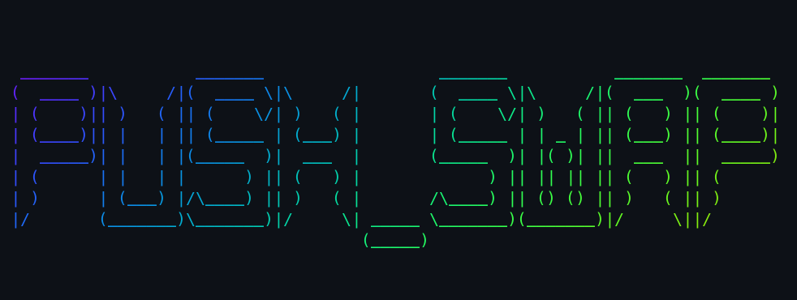

# push_swap

    

 This project is about sorting a stack with as few operations as possible.

---
### About this project
I didn't like the proposal of this project very much. push_swap aims its focus on Algorithms and Data Structures and supposedly algorithmic complexity, although this may be true in some cases, I didn't have to think about algorithmic complexity at any point during the development of this project. In the end, all that matters is printing the right moves on the screen; the time your algorithm will take to execute doesn't matter. But regarding data structures, this project will make you completely master linked lists and stacks.

### Complexity
The complexity of an algorithm is a parameter to analyze how fast or slow a particular algorithm performs, more specifically, how much time and space is spent based on the input. A search algorithm that looks for a specific word in a sorted array will perform an operation for each item in the array; this algorithm is known as linear search. On the other hand, the famous binary search looks for halves, dramatically reducing complexity; in this case, we have logarithmic complexity. To delve deeper into algorithmic complexity analysis, research Big O Notation.

    

### Stack
A stack is a data structure that is simmilar to a singly linked list, but with specific rules for adding and removing elements. A stack is a **LIFO** structure: **L**ast **I**n **F**irst **O**ut. So in a stack it is only possible to add an item to the top, and it always only possible to remove an item from the top (Although in push_swap, the stack used is a pseudo-stack, as we can access and move the item from the stack's base).

    

The basic two operations are called:
- `push()`: Insert an item at the top of the stack.
- `pop()`: Remove the item from the top of the stack.

In this project you'll develop more advanced moves such as Rotate or Swap a stack.

Usually, a stack is implemented using a kind of linked list to facilitate the straightforward addition and removal of items. Here's a tip: when I learned Algorithms and Basic Data Structures (linked list, queue, stack), I learned it with Object-Oriented Programming (OOP). So, the stack would be a class that has an attribute of the Node class, and this concept made it much easier for me to understand Linked Lists and Nodes. I recommend doing it this way: have a separate struct for the Node, containing pointers for next/previous and the content, and another separate struct for the Stack, containing a pointer to the top of the stack and some other useful attributes you may want (such as the size of the stack, which will be useful for the algorithm I chose to use for push_swap). This will make your code way clearer to read, so instead of using `**stack` for accessing the top node, you'll be doing `stack.top` (It may seem trivial, but especially for beginners, this helps a lot in not getting lost in the logic of lists).

### Turkish Sort
For this specific project, the majority of 42 cadets choose to use a sorting algorithm called Radix. This algorithm sorts without comparisons, based on the decimal place (or bit). I didn't like this algorithm, but I was compelled to use it because it is sufficient to pass with 80 points and is not too complex. However, a friend of mine (Shoutout to Rafael) showed me an algorithm created by a Turkish cadet, which I affectionately nicknamed Turkish Sort. This algorithm is enough to achieve a 100% score (if done well, unlike me; I couldn't optimize it to get 5 points on tests with 500 numbers), and its logic is quite intuitive (unlike the code, which is considerably complex). I'll leave the link to A. Yigit Ogun's article: https://medium.com/@ayogun/push-swap-c1f5d2d41e97

    

# push_swap
